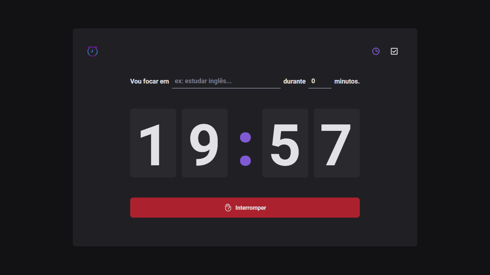
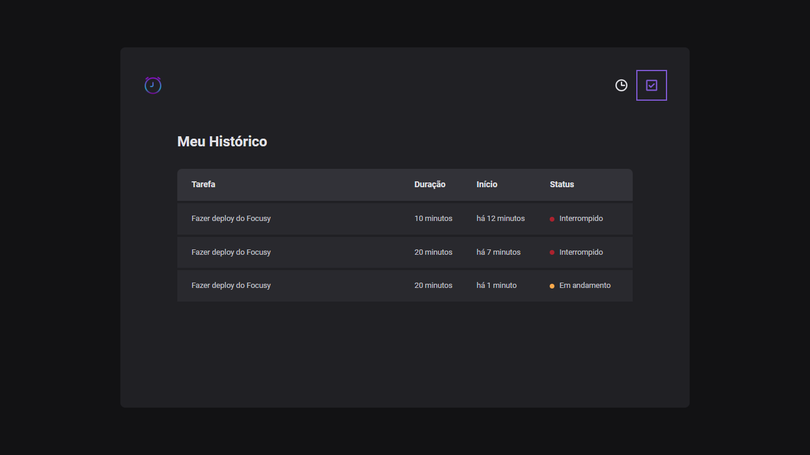

<h1 align="center">
    Focusy - Time Tracker
</h1>

<p align="center">
  <a href="#about">About</a> •
  <a href="#features">Features</a> •
  <a href="#how-to-use">How to use</a> •
  <a href="#technologies">Technologies</a>
</p>

<div align="center"> 
	
</div>

<div align="center"> 
	
</div>

## About

⏳Focusy is a time tracker that will help you to be more focused and productive.

---

## Features

- [x] Create a timer
- [x] Interrupt timer
- [x] Log timer history
- [x] Persist data in local storage

---

## How to use

### With the terminal open, clone to your local machine:
```
git clone https://github.com/gabrielbugarelli/focusy.git
```

### Enter the project folder and install the dependencies with the command:
```
npm install
```

### Run the project with the command:
```
npm start
```

### After that, the project will be raised on port localhost:3000
---
## Technologies
- [Typescript](https://www.typescriptlang.org/)
- [Vite](https://vitejs.dev/)
- [Styled-Components](https://styled-components.com/)
- [react-hook-form](https://react-hook-form.com/)
